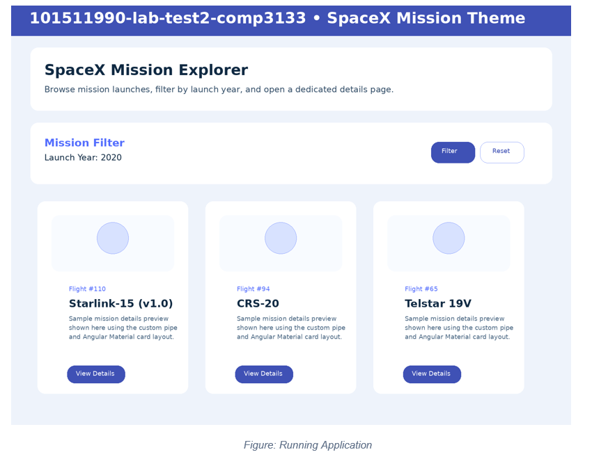
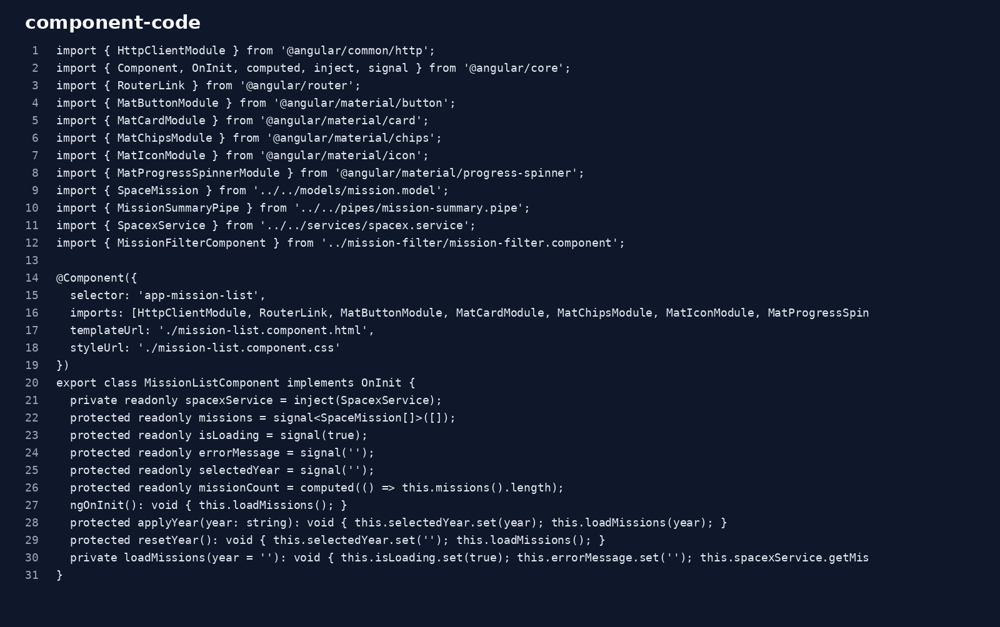
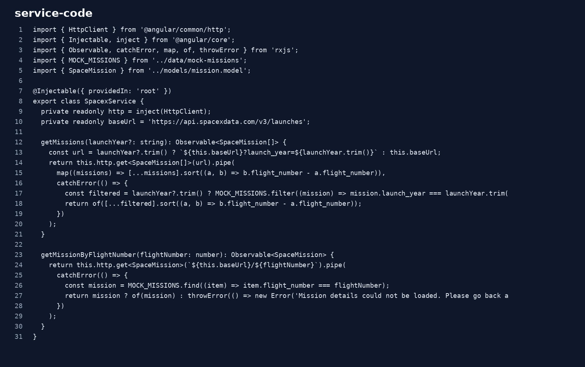
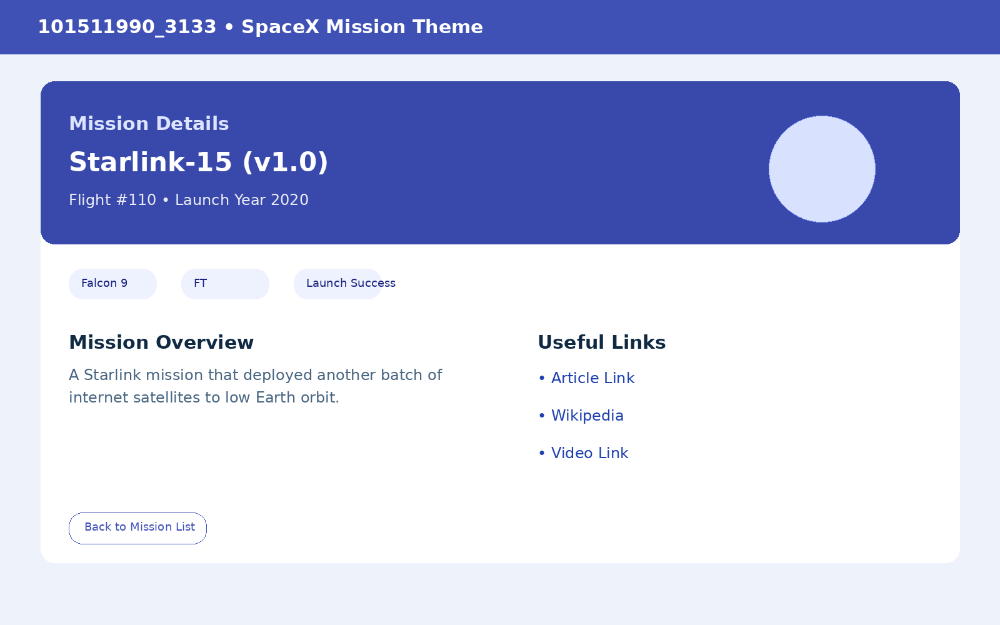

# 101511990-lab-test2-comp3133- SpaceX Mission Explorer

## App Description

This Angular HTTP Client application displays SpaceX mission launches using a public API and provides mission filtering by launch year plus a dedicated mission details page.

## Features Implemented

- Angular latest major version project structure (Angular 21 style setup)
- `HttpClientModule`, `FormsModule`, and `ReactiveFormsModule`
- `missionlist`, `missionfilter`, and `missiondetails` components
- SpaceX API service with fallback mock data for offline/demo reliability
- Proper TypeScript interfaces and a custom `missionSummary` pipe
- Required Angular template features: `@for`, `@if`, `@switch`, and `signal`
- Angular Material based UI styling
- Search/filter by launch year
- Mission details route by flight number

## Project Structure

```text
src/
  app/
    components/
      mission-filter/
      mission-list/
      mission-details/
    data/
      mock-missions.ts
    models/
      mission.model.ts
    pipes/
      mission-summary.pipe.ts
    services/
      spacex.service.ts
```

## Screenshots

### Running application - Mission List



### Code - Mission List component



### Code - SpaceX service API call



### Output UI - Mission Details page



## How to Run

1. Open a terminal in this project folder.
2. Run `npm install`.
3. Run `npm start`.
4. Open `http://localhost:4200/`.

## Submission Links

- GitHub Repository Link: **https://github.com/bramjot14/101511990-lab-test2-comp3133**
- Deployment Link (Vercel/Render): **ADD_YOUR_DEPLOYMENT_LINK_HERE**

## Notes

The application uses the SpaceX REST API and includes an offline fallback dataset so the UI can still render for demonstration or screenshot purposes if the API is temporarily unavailable.
